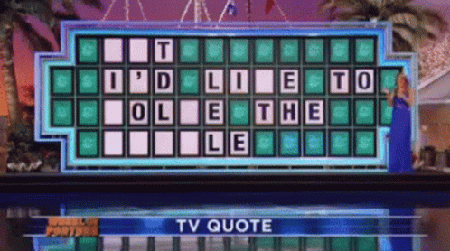

# Card Hangman

## Description
You will need to create a hangman game in python. (in the terminal)

## Instructions

### Hangman
Create a `Hangman` class containing:
- A `possible_words` property that contain a list of string. Each element is a word that could be selected to be the `word_to_find`. It has to contain at least those words: `['['becode', 'learning', 'mathematics', 'sessions']`.
- A `word_to_fine` property that contain a list of string. Each element will be a letter of the word.
- A `life` propertu that contain the life that the player still has. It should start at 5.
- A `well_guessed_letters` property that contain a list of string where each element will be a letter guessed by the user. It should start equel to: `_ _ _ _ _` with the same number of `_` as the lenght of the word. Each time the user found a letter, replace the `_` with the letter. If the word contain multiple time the same letter, it should put those letters at each place that should contain it. For example if the first guess of the user is `P` and the good word is `P A P E R` then `well_guessed_letters` should be equal to ` P _ P _ _`.

- A `bad_guessed_letters` property that contain a list of string where each element will be a letter guessed by the user that is mot in the `word_to_find`.
- A `turn_count` that contain the number of turn played by the player. -> int
- A `error_count` that contains the number of errors made by the player.
- A `good_answers` that contains the number of well guessed letters. 
- A `play()` method that ask to the player to enter a letter. Be carrefull that the player shouldn't be allowed to type something else than a letter, and not more than a letter. If the player guessed well a letter, add it to the `well_guessed_letters` if not, add it to the `bad_guessed_letters` and add 1 to `error_count`.
- A `start_game()` 
    - that will run `play()` until the game is over (because the use guess the word or because of a game over). 
    - If at any moment `life` is equal to 0, then `game_over()` should be called. 
    - If all the letter are guesse, `well_played()` should be called.
    - At the end of each turn, you should print `well_guessed_letters`, `bad_guessed_letters`, `life`, `error_count` and `turn_count`.
- A `game_over()` method that will stop the game and print `game over...`
- A `well played()` method that will print `You found the word: {word_to_find_here} in {turn_count_here} turns with {error_count_here} errors!`

## File structure
- All the class declaration should be in a `game.py` file which should be in a `utils` folder. 
- All the code that run the game (the main loop) should be in a main.py file.  
This loop should be in the `main.py` file.

## Constraints
- Add **typing** and **docstrings** for **each functions and classes**.
- Typing should be complete. If you use a list of string, you should specify it in your typing. Same for complexe dict typing. See typing module for more informations.
- Clean the code before sending it to code review.
- Comment your code in a way that make sense.
- Push your code on a github repository.
