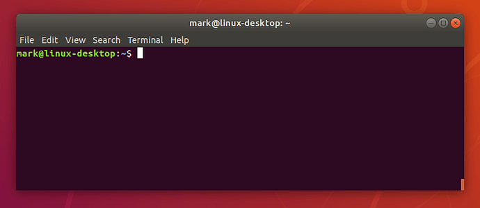

# Introduction

## What is the terminal?
The terminal is this ugly black and white text box:



But what's the purpose of it? Well, when you use your computer, you see this nice UI with graphical elements. But the computer can't understand that. It just now that you click on this icon, and that when you click on it. It should run the corresponding command to run the program you want.

Let's take a concret example. On Ubuntu, install firefox (it should be installed by default). So if you click on the firefox icon, it will open a firefox window. If you want to now what's happening behind the scenes, you can run `firefox` in your terminal. The exact same result!

It's because that's what your sytem do! It only run commands.

## Why using the terminal then?
Becuase:
* It's way more powerfull than your UI
* It allow you to use tools and do stuff that you can't do only with your UI.
* Because when you will want to deploy your code on a server, you will not have any UI to do it. You will need to set-up everything directly using command lines.
* Because when you start using it, it become adictive and you improve your productivity.

## Where to start?
The first step would be to learn how the terminal works.

Let's analyse the first line we see:

```bash
maxim@maxim-computer: ~$
```

Whath doest it mean?! 

Calm down, in fact it's simple.

* `maxim` the first part is the your session user. The one that you connect to when you login in your computer.
* `@` is a separator between the user and the machine's name.
* `maxim-pc:` is a your computer's name.
* `~` is the path where you are. By default your terminal start in your home directory which. It's generaly located to `/home/<YOU_USER>`. The symbole `~` is associated to it.
* `$` is to say that you're in normal mode. The other possibility to replace this symbole is `#` it would mean that you're in `sudo mode`. A mode where all the commands are run as `root` it means as a super-user that have all the rights on you computer.

Great! Now we know what does that line mean! We can move on. We will start typing commands.

## Man
For each command that exist, there is a documentation integrated to the terminal. Just type `man` followed by any comment and it will show you the documentation.

## List files
If you want to know what are the folders and files in your curent directory (remember, by default you will be in your home directory). You can use the `ls` command.

Try it!

As you can see there is a bunch of file in your home directory like `Desktop`, `Download`, `Pictures`,...

**Pro tips:** You can also add a path after ls. For example if I want to see the content of the folder `becode` which is in the folder `Desktop`:

```bash
ls Desktop/becode
```

## Move!
If you wan to see what's inside your Desktop for example, you can tell to your terminal to move into this directory. To do so, you can use the `cd` command followd by the folder's name you want to go to. So in our case, we will type:

```bash
cd Desktop
```
Now you should see a in at the start of the new line:

```bash
maxim@maxim-computer: ~/Desktop$
```

To get back one folder behind your can use

```bash
cd ..
```

**Pro tips:** If you want to come back to you home directory, type `cd` alone. It will do the job.

It show you where you are in your machine. Try `ls` now. Is there any file on your Desktop?

If note let's create one!

## Create a file
To create a filer you can type `touch` followd by your file's name:
Let's create a test.txt file on your desktop

```bash
touch test.txt
```

Now you can do a `ls` to see if the file has been created.

## Create a folder
If we want to create a new folder, we can use the `mkdir` followed by the dir's name.
```bash
mkdir test_folder
```

## Remove a file
We don't want our test file and directory to stay there for ever. 
To delete them, you can use the `rm` command followed by your file/folder. If you try to delete a folder or a folder that contains files you will get an error. I let you google what have to be done to do so. 

## Find a file
Let's say you in a folder that container a lot of other folders and files. know that there is a file somewhere that container `becode` in its name. 

You could use `find`.

## Show file's content
From the terminal, you can print the content of a file.
`cat myfile.txt`

## Find a line in a file
You want to see the line where a word is in?
Just use `grep` ! You can concate this commande with any command that ouput something.

For example if I want to see if my file contain `learning` and see the context of it, I could type:
```bash

cat myfile.txt | grep "learning"
```

Here the pipe `|` will be use to concate two commands.

## Sudo
Some command will ask you some priviledge. Like if you want to install a new software. You computer you ask you to run the command as `sudo`. Which means as administrator of the system (also called root).

**Pro Tips:** If you need to apply sudo to the last command you typed, try using the following:

```bash
sudo !!
```

It will re-run the last command with sudo before.
